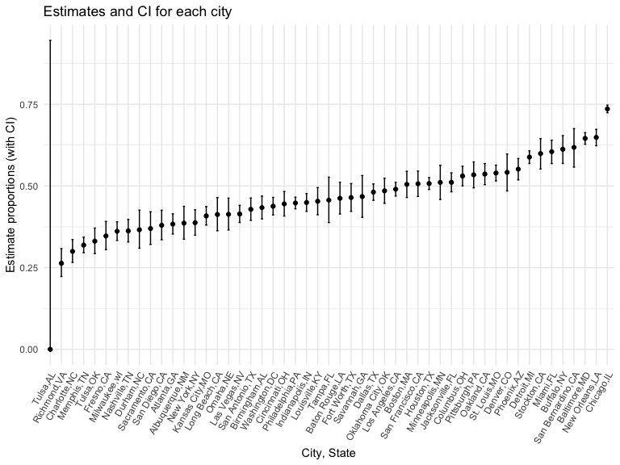

p8105_hw5_zx2424
================
Zhaoqianyu Xiong
2022-11-16

## Problem 1

Iterate over file names and read in data for each subject and save the
results as a new variable full_df.

``` r
full_df = 
  tibble(
    files = list.files("./data/"),
    path = str_c("./data/", files) ) %>% 
  mutate(data = map(path, read_csv)) %>% 
  unnest(cols = c(data))
```

    ## Rows: 1 Columns: 8
    ## ── Column specification ────────────────────────────────────────────────────────
    ## Delimiter: ","
    ## dbl (8): week_1, week_2, week_3, week_4, week_5, week_6, week_7, week_8
    ## 
    ## ℹ Use `spec()` to retrieve the full column specification for this data.
    ## ℹ Specify the column types or set `show_col_types = FALSE` to quiet this message.
    ## Rows: 1 Columns: 8
    ## ── Column specification ────────────────────────────────────────────────────────
    ## Delimiter: ","
    ## dbl (8): week_1, week_2, week_3, week_4, week_5, week_6, week_7, week_8
    ## 
    ## ℹ Use `spec()` to retrieve the full column specification for this data.
    ## ℹ Specify the column types or set `show_col_types = FALSE` to quiet this message.
    ## Rows: 1 Columns: 8
    ## ── Column specification ────────────────────────────────────────────────────────
    ## Delimiter: ","
    ## dbl (8): week_1, week_2, week_3, week_4, week_5, week_6, week_7, week_8
    ## 
    ## ℹ Use `spec()` to retrieve the full column specification for this data.
    ## ℹ Specify the column types or set `show_col_types = FALSE` to quiet this message.
    ## Rows: 1 Columns: 8
    ## ── Column specification ────────────────────────────────────────────────────────
    ## Delimiter: ","
    ## dbl (8): week_1, week_2, week_3, week_4, week_5, week_6, week_7, week_8
    ## 
    ## ℹ Use `spec()` to retrieve the full column specification for this data.
    ## ℹ Specify the column types or set `show_col_types = FALSE` to quiet this message.
    ## Rows: 1 Columns: 8
    ## ── Column specification ────────────────────────────────────────────────────────
    ## Delimiter: ","
    ## dbl (8): week_1, week_2, week_3, week_4, week_5, week_6, week_7, week_8
    ## 
    ## ℹ Use `spec()` to retrieve the full column specification for this data.
    ## ℹ Specify the column types or set `show_col_types = FALSE` to quiet this message.
    ## Rows: 1 Columns: 8
    ## ── Column specification ────────────────────────────────────────────────────────
    ## Delimiter: ","
    ## dbl (8): week_1, week_2, week_3, week_4, week_5, week_6, week_7, week_8
    ## 
    ## ℹ Use `spec()` to retrieve the full column specification for this data.
    ## ℹ Specify the column types or set `show_col_types = FALSE` to quiet this message.
    ## Rows: 1 Columns: 8
    ## ── Column specification ────────────────────────────────────────────────────────
    ## Delimiter: ","
    ## dbl (8): week_1, week_2, week_3, week_4, week_5, week_6, week_7, week_8
    ## 
    ## ℹ Use `spec()` to retrieve the full column specification for this data.
    ## ℹ Specify the column types or set `show_col_types = FALSE` to quiet this message.
    ## Rows: 1 Columns: 8
    ## ── Column specification ────────────────────────────────────────────────────────
    ## Delimiter: ","
    ## dbl (8): week_1, week_2, week_3, week_4, week_5, week_6, week_7, week_8
    ## 
    ## ℹ Use `spec()` to retrieve the full column specification for this data.
    ## ℹ Specify the column types or set `show_col_types = FALSE` to quiet this message.
    ## Rows: 1 Columns: 8
    ## ── Column specification ────────────────────────────────────────────────────────
    ## Delimiter: ","
    ## dbl (8): week_1, week_2, week_3, week_4, week_5, week_6, week_7, week_8
    ## 
    ## ℹ Use `spec()` to retrieve the full column specification for this data.
    ## ℹ Specify the column types or set `show_col_types = FALSE` to quiet this message.
    ## Rows: 1 Columns: 8
    ## ── Column specification ────────────────────────────────────────────────────────
    ## Delimiter: ","
    ## dbl (8): week_1, week_2, week_3, week_4, week_5, week_6, week_7, week_8
    ## 
    ## ℹ Use `spec()` to retrieve the full column specification for this data.
    ## ℹ Specify the column types or set `show_col_types = FALSE` to quiet this message.
    ## Rows: 1 Columns: 8
    ## ── Column specification ────────────────────────────────────────────────────────
    ## Delimiter: ","
    ## dbl (8): week_1, week_2, week_3, week_4, week_5, week_6, week_7, week_8
    ## 
    ## ℹ Use `spec()` to retrieve the full column specification for this data.
    ## ℹ Specify the column types or set `show_col_types = FALSE` to quiet this message.
    ## Rows: 1 Columns: 8
    ## ── Column specification ────────────────────────────────────────────────────────
    ## Delimiter: ","
    ## dbl (8): week_1, week_2, week_3, week_4, week_5, week_6, week_7, week_8
    ## 
    ## ℹ Use `spec()` to retrieve the full column specification for this data.
    ## ℹ Specify the column types or set `show_col_types = FALSE` to quiet this message.
    ## Rows: 1 Columns: 8
    ## ── Column specification ────────────────────────────────────────────────────────
    ## Delimiter: ","
    ## dbl (8): week_1, week_2, week_3, week_4, week_5, week_6, week_7, week_8
    ## 
    ## ℹ Use `spec()` to retrieve the full column specification for this data.
    ## ℹ Specify the column types or set `show_col_types = FALSE` to quiet this message.
    ## Rows: 1 Columns: 8
    ## ── Column specification ────────────────────────────────────────────────────────
    ## Delimiter: ","
    ## dbl (8): week_1, week_2, week_3, week_4, week_5, week_6, week_7, week_8
    ## 
    ## ℹ Use `spec()` to retrieve the full column specification for this data.
    ## ℹ Specify the column types or set `show_col_types = FALSE` to quiet this message.
    ## Rows: 1 Columns: 8
    ## ── Column specification ────────────────────────────────────────────────────────
    ## Delimiter: ","
    ## dbl (8): week_1, week_2, week_3, week_4, week_5, week_6, week_7, week_8
    ## 
    ## ℹ Use `spec()` to retrieve the full column specification for this data.
    ## ℹ Specify the column types or set `show_col_types = FALSE` to quiet this message.
    ## Rows: 1 Columns: 8
    ## ── Column specification ────────────────────────────────────────────────────────
    ## Delimiter: ","
    ## dbl (8): week_1, week_2, week_3, week_4, week_5, week_6, week_7, week_8
    ## 
    ## ℹ Use `spec()` to retrieve the full column specification for this data.
    ## ℹ Specify the column types or set `show_col_types = FALSE` to quiet this message.
    ## Rows: 1 Columns: 8
    ## ── Column specification ────────────────────────────────────────────────────────
    ## Delimiter: ","
    ## dbl (8): week_1, week_2, week_3, week_4, week_5, week_6, week_7, week_8
    ## 
    ## ℹ Use `spec()` to retrieve the full column specification for this data.
    ## ℹ Specify the column types or set `show_col_types = FALSE` to quiet this message.
    ## Rows: 1 Columns: 8
    ## ── Column specification ────────────────────────────────────────────────────────
    ## Delimiter: ","
    ## dbl (8): week_1, week_2, week_3, week_4, week_5, week_6, week_7, week_8
    ## 
    ## ℹ Use `spec()` to retrieve the full column specification for this data.
    ## ℹ Specify the column types or set `show_col_types = FALSE` to quiet this message.
    ## Rows: 1 Columns: 8
    ## ── Column specification ────────────────────────────────────────────────────────
    ## Delimiter: ","
    ## dbl (8): week_1, week_2, week_3, week_4, week_5, week_6, week_7, week_8
    ## 
    ## ℹ Use `spec()` to retrieve the full column specification for this data.
    ## ℹ Specify the column types or set `show_col_types = FALSE` to quiet this message.
    ## Rows: 1 Columns: 8
    ## ── Column specification ────────────────────────────────────────────────────────
    ## Delimiter: ","
    ## dbl (8): week_1, week_2, week_3, week_4, week_5, week_6, week_7, week_8
    ## 
    ## ℹ Use `spec()` to retrieve the full column specification for this data.
    ## ℹ Specify the column types or set `show_col_types = FALSE` to quiet this message.

Tidy the results.

``` r
tidy_df = 
  full_df %>% 
  mutate(
    files = str_replace(files, ".csv", ""),
    group = str_sub(files, 1, 3)) %>%  
  pivot_longer(
    week_1:week_8,
    names_to = "week",
    values_to = "outcome",
    names_prefix = "week_") %>% 
  mutate(week = as.numeric(week)) %>% 
  select(group, subj = files, week, outcome) 

tidy_df
```

    ## # A tibble: 160 × 4
    ##    group subj    week outcome
    ##    <chr> <chr>  <dbl>   <dbl>
    ##  1 con   con_01     1    0.2 
    ##  2 con   con_01     2   -1.31
    ##  3 con   con_01     3    0.66
    ##  4 con   con_01     4    1.96
    ##  5 con   con_01     5    0.23
    ##  6 con   con_01     6    1.09
    ##  7 con   con_01     7    0.05
    ##  8 con   con_01     8    1.94
    ##  9 con   con_02     1    1.13
    ## 10 con   con_02     2   -0.88
    ## # … with 150 more rows

Make a spaghetti plot showing observations on each subject over time.
For the control group, their outcomes do not change over time, while the
outcomes for experiment group increase over time.

``` r
tidy_df %>% 
  ggplot(aes(x = week, y = outcome, group = subj, color = group)) + 
  geom_point() + 
  geom_path() + 
  facet_grid(~group)
```


## Problem 2

Import and describe the raw data.

``` r
homicide_raw = read_csv("https://raw.githubusercontent.com/washingtonpost/data-homicides/master/homicide-data.csv")
```

    ## Rows: 52179 Columns: 12
    ## ── Column specification ────────────────────────────────────────────────────────
    ## Delimiter: ","
    ## chr (9): uid, victim_last, victim_first, victim_race, victim_age, victim_sex...
    ## dbl (3): reported_date, lat, lon
    ## 
    ## ℹ Use `spec()` to retrieve the full column specification for this data.
    ## ℹ Specify the column types or set `show_col_types = FALSE` to quiet this message.

``` r
homicide_raw
```

    ## # A tibble: 52,179 × 12
    ##    uid   repor…¹ victi…² victi…³ victi…⁴ victi…⁵ victi…⁶ city  state   lat   lon
    ##    <chr>   <dbl> <chr>   <chr>   <chr>   <chr>   <chr>   <chr> <chr> <dbl> <dbl>
    ##  1 Alb-…  2.01e7 GARCIA  JUAN    Hispan… 78      Male    Albu… NM     35.1 -107.
    ##  2 Alb-…  2.01e7 MONTOYA CAMERON Hispan… 17      Male    Albu… NM     35.1 -107.
    ##  3 Alb-…  2.01e7 SATTER… VIVIANA White   15      Female  Albu… NM     35.1 -107.
    ##  4 Alb-…  2.01e7 MENDIO… CARLOS  Hispan… 32      Male    Albu… NM     35.1 -107.
    ##  5 Alb-…  2.01e7 MULA    VIVIAN  White   72      Female  Albu… NM     35.1 -107.
    ##  6 Alb-…  2.01e7 BOOK    GERALD… White   91      Female  Albu… NM     35.2 -107.
    ##  7 Alb-…  2.01e7 MALDON… DAVID   Hispan… 52      Male    Albu… NM     35.1 -107.
    ##  8 Alb-…  2.01e7 MALDON… CONNIE  Hispan… 52      Female  Albu… NM     35.1 -107.
    ##  9 Alb-…  2.01e7 MARTIN… GUSTAVO White   56      Male    Albu… NM     35.1 -107.
    ## 10 Alb-…  2.01e7 HERRERA ISRAEL  Hispan… 43      Male    Albu… NM     35.1 -107.
    ## # … with 52,169 more rows, 1 more variable: disposition <chr>, and abbreviated
    ## #   variable names ¹​reported_date, ²​victim_last, ³​victim_first, ⁴​victim_race,
    ## #   ⁵​victim_age, ⁶​victim_sex

The dataset contains 52179 rows and 12 columns, with each row
representing a homicide case. Variables include reported date, first and
last name of the victims, race, age and sex of victims, the city and
state where they happened, the exact location of the homicides, the
disposition of the cases.

Create a city_state variable.

``` r
homicide = 
  homicide_raw %>%
  janitor::clean_names() %>%
  mutate(city_state = str_c(city, sep = ",", state)) %>%
  mutate(status = ifelse(disposition == "Closed by arrest", "0", "1")) %>%
  mutate(status = as.integer(status)) 
```

Summarize within cities to obtain the total number of homicides and the
number of unsolved homicides.

``` r
homicide_nest = 
  homicide %>%
  select(city_state, status) %>%
  nest(data = status)

total_and_unsolved = 
  function(df){
    total_df = as.integer(count(df))
    unsolved_df = sum(df)
    
    tibble(total = total_df,
         unsolved = unsolved_df)
  }

n_total_unsolved = 
  homicide_nest %>%
  mutate(model1 = map(homicide_nest$data, total_and_unsolved)) %>%
  unnest(model1) %>%
  select(-data)

n_total_unsolved
```

    ## # A tibble: 51 × 3
    ##    city_state     total unsolved
    ##    <chr>          <int>    <int>
    ##  1 Albuquerque,NM   378      146
    ##  2 Atlanta,GA       973      373
    ##  3 Baltimore,MD    2827     1825
    ##  4 Baton Rouge,LA   424      196
    ##  5 Birmingham,AL    800      347
    ##  6 Boston,MA        614      310
    ##  7 Buffalo,NY       521      319
    ##  8 Charlotte,NC     687      206
    ##  9 Chicago,IL      5535     4073
    ## 10 Cincinnati,OH    694      309
    ## # … with 41 more rows

Estimate the proportion of unsolved homicides for Baltimore, MD.

``` r
output_Baltimore = 
prop.test(x = n_total_unsolved$unsolved[3], n = n_total_unsolved$total[3]) %>%
  broom::tidy() %>%
  select(estimate, starts_with("conf"))

output_Baltimore 
```

    ## # A tibble: 1 × 3
    ##   estimate conf.low conf.high
    ##      <dbl>    <dbl>     <dbl>
    ## 1    0.646    0.628     0.663

Write a function that can generate the results – estimated proportion
and confidence interval.

``` r
p_and_CI =
  function(x, n) {
     prop.test(x, n) %>%
      broom::tidy() %>%
      select(estimate, starts_with("conf"))
  }
```

Create a tidy dataframe with estimated proportions and CIs for each
city.

``` r
prop_df = 
n_total_unsolved %>%
  mutate(model2 = map2(.x = unsolved, .y = total, ~p_and_CI(x = .x, n = .y))) %>%
  unnest(model2) %>%
  select(-total, -unsolved)

prop_df
```

    ## # A tibble: 51 × 4
    ##    city_state     estimate conf.low conf.high
    ##    <chr>             <dbl>    <dbl>     <dbl>
    ##  1 Albuquerque,NM    0.386    0.337     0.438
    ##  2 Atlanta,GA        0.383    0.353     0.415
    ##  3 Baltimore,MD      0.646    0.628     0.663
    ##  4 Baton Rouge,LA    0.462    0.414     0.511
    ##  5 Birmingham,AL     0.434    0.399     0.469
    ##  6 Boston,MA         0.505    0.465     0.545
    ##  7 Buffalo,NY        0.612    0.569     0.654
    ##  8 Charlotte,NC      0.300    0.266     0.336
    ##  9 Chicago,IL        0.736    0.724     0.747
    ## 10 Cincinnati,OH     0.445    0.408     0.483
    ## # … with 41 more rows

Create a plot that shows the estimated unsolved homicide proportions and
CIs for each city.

``` r
 prop_df %>%
  mutate(city_state = fct_reorder(city_state, estimate)) %>%
  ggplot(aes(x = city_state, y = estimate)) +
  geom_point() +
  geom_errorbar(aes(ymin = conf.low, ymax = conf.high), width = 0.2) +
  theme(axis.text.x = element_text(angle = 60, hjust = 1)) +
  labs(title = "Estimates and CI for each city",
       x = "City, State",
       y = "Estimate proportions (with CI)") 
```


